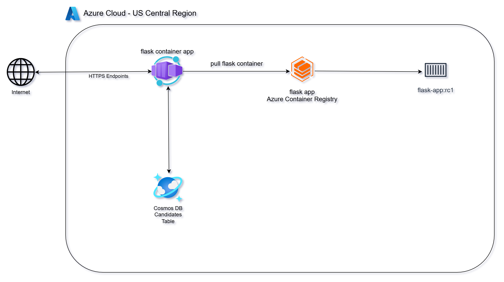
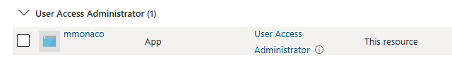
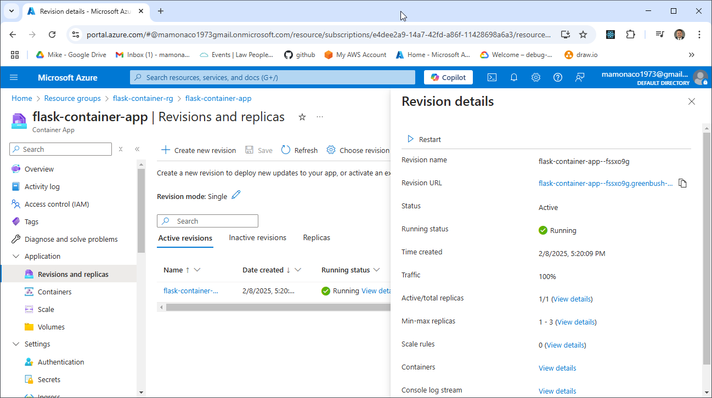

# Deploying Simple Containers in Azure

Welcome to **Video 2** of the [Simple Containers Series](https://www.youtube.com/@MikesCloudSolutions), where we’ll focus on containerizing a Python-based microservice and deploying it as an **Azure Container App**. This video complements the [Azure VM Scale Sets](https://www.youtube.com/watch?v=a3l4qUfVvGQ) video, where we deployed Flask microservices using **Virtual Machines** and **Virtual Machine Scale Sets**. That same microservice will be packaged as a container and deployed as an **Azure Container App**.

### In This Video, We'll:

- Use **Azure Cosmos DB** for persistent data storage
- **Containerize** the Python microservice using **Docker**  
- **Push** the container image to **Azure Container Registry (ACR)**  
- **Deploy** the container as an **Azure Container App**  

## Azure Container Registry: Simplifying Container Image Management

**Azure Container Registry (ACR)** is a fully managed Docker container registry provided by Microsoft Azure. It allows you to store, manage, and deploy container images securely and at scale. ACR integrates seamlessly with Azure services like **Container Apps**, **Azure Kubernetes Service (AKS)**, and **App Service**, making it easy to deploy containerized applications.

### **Key Features:**
- **Private & Public Repositories:** Store container images securely with fine-grained access control.
- **Integration with CI/CD:** Easily integrates with GitHub Actions, Azure DevOps, and Jenkins for automated deployments.
- **High Availability:** Azure manages replication, durability, and scaling behind the scenes.
- **Security:** Supports encryption at rest and in transit, plus Azure Active Directory (AAD)-based access control.

### **How It Works:**
1. **Build** your Docker image locally or in a CI/CD pipeline.
2. **Tag** the image with your ACR repository URL.
3. **Push** the image to ACR using Docker CLI or automation tools.
4. **Pull** the image from ACR to deploy in services like Container Apps, AKS, or App Service.

## Azure Container App: Effortless Deployment for Containerized Applications

**Azure Container Apps** is a fully managed service that makes it easy to deploy and run containerized web applications and APIs without managing servers. Azure Container Apps abstracts away infrastructure management, handling scaling, load balancing, and deployments automatically.

### **Key Features:**
- **Simple Deployment:** Deploy directly from Azure Container Registry (ACR), GitHub, or a container registry with minimal configuration.
- **Automatic Scaling:** Automatically scales up or down based on incoming traffic, including scaling to zero during idle periods.
- **Built-in Load Balancing:** Distributes incoming requests without the need to configure a separate load balancer.
- **Secure by Default:** Supports HTTPS endpoints, environment variables encryption, and Azure Role-Based Access Control (RBAC) for secure access to Azure services.

### **How It Works:**
1. **Source:** Connect to a container image from ACR or a source code repository (Azure Container Apps can build it for you).
2. **Configure:** Set runtime settings like environment variables, CPU/memory limits, and deployment policies.
3. **Deploy:** Azure Container Apps handles provisioning, load balancing, scaling, and monitoring automatically.
4. **Manage:** Monitor logs, metrics, and scale settings via the Azure Portal, CLI, or Azure Monitor.



## Prerequisites

* [An Azure Account](https://portal.azure.com/)
* [Install AZ CLI](https://learn.microsoft.com/en-us/cli/azure/install-azure-cli) 
* [Install Latest Terraform](https://developer.hashicorp.com/terraform/install)
* [Install Postman](https://www.postman.com/downloads/) for testing
* [Install Docker](https://docs.docker.com/engine/install/)
* [Microsoft.App](https://learn.microsoft.com/en-us/azure/container-apps/) Provider must be enabled
* `User Access Administrator` role must be assigned to build identity




If this is your first time watching our content, we recommend starting with this video: [Azure + Terraform: Easy Setup](https://www.youtube.com/watch?v=wwi3kVgYNOk). It provides a step-by-step guide to properly configure Terraform, Packer, and the AZ CLI.

## Download this Repository

```bash
git clone https://github.com/mamonaco1973/azure-flask-container.git
cd azure-flask-container
```

## Build the Code

Run [check_env](check_env.sh) then run [apply](apply.sh).

```bash
~/azure-flask-container$ ./apply.sh
NOTE: Validating that required commands are found in your PATH.
NOTE: az is found in the current PATH.
NOTE: docker is found in the current PATH.
NOTE: terraform is found in the current PATH.
NOTE: All required commands are available.
NOTE: Validating that required environment variables are set.
NOTE: ARM_CLIENT_ID is set.
NOTE: ARM_CLIENT_SECRET is set.
NOTE: ARM_SUBSCRIPTION_ID is set.
NOTE: ARM_TENANT_ID is set.
NOTE: All required environment variables are set.
NOTE: Logging in to Azure using Service Principal...
NOTE: Successfully logged into Azure.
NOTE: Microsoft.App is currently registered!
NOTE: 'User Access Administrator' role is assigned to current service principal.
NOTE: Building ACR Instance.
Initializing the backend...
Initializing provider plugins...
- Finding latest version of hashicorp/azurerm...
- Installing hashicorp/azurerm v4.18.0...
- Installed hashicorp/azurerm v4.18.0 (signed by HashiCorp)
[...]
```

### **Build Process Overview**

The build process consists of three distinct phases:

#### 1. Build the Azure Container Registry (ACR) Instance
- Creates an Azure Container Registry (ACR) using Terraform to store Docker images.

#### 2. Build the Docker Image and Push it
- Builds the Flask Docker container and pushes the image to the ACR repository.

#### 3. Deploy to Azure Container Apps
- Deploys the Flask container to an Azure Container App using Terraform.

#### Final Validation
- After the deployment completes, the `test_candidates.py` script is run to verify the solution and ensure everything is functioning as expected.

## Tour of Build Output in the Azure Console

- **The ACR Instance**


- **The Container App Instance**

 
## Flask Endpoint Summary

- [Source Code](./02-docker/app.py)

### `/gtg` (GET)
- **Purpose**: Health check.
- **Response**: 
  - `{"connected": "true", "instance-id": <instance_id>}` (if `details` query parameter is provided).
  - 200 OK with no body otherwise.

### `/candidate/<name>` (GET)
- **Purpose**: Retrieve a candidate by name.
- **Response**: 
  - Candidate details (JSON) with status `200`.
  - `"Not Found"` with status `404` if no candidate is found.

### `/candidate/<name>` (POST)
- **Purpose**: Add or update a candidate by name.
- **Response**: 
  - `{"CandidateName": <name>}` with status `200`.
  - `"Unable to update"` with status `500` on failure.

### `/candidates` (GET)
- **Purpose**: Retrieve all candidates.
- **Response**: 
  - List of candidates (JSON) with status `200`.
  - `"Not Found"` with status `404` if no candidates exist.