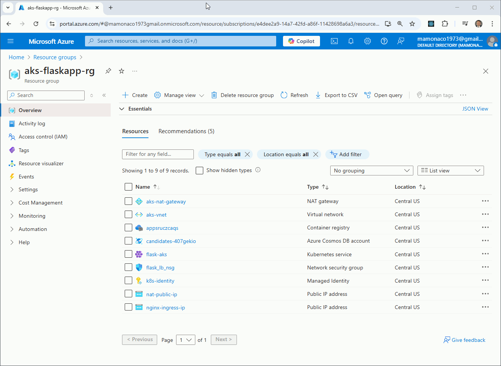

## Containerizing Applications with Azure Kubernetes Service (AKS)

Welcome to **Video 2** of the [Kubernetes In the Cloud](https://github.com/mamonaco1973/cloud-k8s-intro/blob/main/README.md) series.

**This video complements the [Azure VM Scale Sets](https://github.com/mamonaco1973/azure-flask-vmss/blob/main/README.md) and the [Simple Azure Containers](https://github.com/mamonaco1973/azure-flask-container/blob/main/README.md) projects**, where we deployed a simple Python-based microservice using the Flask framework with different cloud services.

This is a **fully automated deployment** of containerized microservices and web apps with **Azure Kubernetes Service (AKS)** — powered by Terraform and shell scripting.

You'll build and deploy:

- **A document database-backed microservice** using:  
  - **Azure Cosmos DB (SQL API)** for fast, globally distributed NoSQL storage.

- **A Docker container** for the Flask microservice, optimized for deployment to **Azure AKS**.

- **Additional standalone Docker containers** that run classic JavaScript games like **[Tetris](https://gist.github.com/straker/3c98304f8a6a9174efd8292800891ea1)**, **[Frogger](https://gist.github.com/straker/82a4368849cbd441b05bd6a044f2b2d3)**, and **[Breakout](https://gist.github.com/straker/98a2aed6a7686d26c04810f08bfaf66b)**.

- **Cloud-native container registry workflows**, pushing all images to:  
  - **Azure Container Registry (ACR)**.

- **Kubernetes workloads on Azure AKS**, managing containerized applications at scale.

- **Kubernetes manifests** including **Deployments**, **Services**, and **Ingress** resources for scalable, fault-tolerant workloads.

- **NGINX as a unified Ingress controller**, exposing all services and games behind a single **Azure Load Balancer**.

## Is Azure AKS PaaS or IaaS?

When deploying Kubernetes with **Azure Kubernetes Service (AKS)**, it’s natural to ask:

> Is AKS considered Infrastructure as a Service (IaaS) or Platform as a Service (PaaS)?

AKS allows you to configure compute resources and scaling parameters — very IaaS-like. But it also fully manages the Kubernetes control plane, handles upgrades, and reduces operational burden — leaning toward PaaS.

The best answer: **AKS offers a PaaS-like experience built on top of IaaS**. It provides declarative infrastructure management layered with Azure-native automation.

---

### Managed Control Plane, Declarative Infrastructure

With **AKS**, you never provision or manage the Kubernetes control plane yourself. Azure handles all of it — including:

- High availability and scaling of control plane components  
- Kubernetes version upgrades and security patches  
- Integration with Azure Monitor and Azure Policy  

You define the node pool configuration, and Azure provisions the required compute using **Virtual Machine Scale Sets (VMSS)** — all via a **declarative, cloud-native interface** that aligns with the PaaS model.

---
### Autoscaling and Node Management: IaaS Beneath the Surface

Even though you don’t directly manage VMs, AKS uses **Virtual Machine Scale Sets** under the hood to scale and maintain worker nodes. You define:

- Node pool VM size and OS  
- Min/max node counts and autoscaling rules  
- Custom node labels and taints  

Azure then automates:

- VM provisioning and zone-aware placement  
- Node repairs and rolling upgrades  
- Integration with **Cluster Autoscaler** and **KEDA** for event-driven scaling  

It’s classic IaaS power, abstracted by Kubernetes orchestration and Azure automation.

---
### Load Balancer Integration

AKS integrates natively with **Azure Load Balancer** and **Azure Application Gateway**. When you expose a Kubernetes `Service` of type `LoadBalancer`, Azure automatically provisions:

- A **Standard Load Balancer**, by default  
- Or an **Application Gateway Ingress Controller (AGIC)**, if configured with annotations  

You don’t have to manually configure backend pools or health probes — the **cloud controller manager** and **ingress controllers** manage that, allowing you to simply define your service and let the infrastructure materialize.

---

### Tagging and Resource Management

AKS relies on **Azure resource tagging** and **resource group scoping** to manage cluster components:

- Tags on subnets and NSGs help AKS with networking and IP assignment  
- Managed identities and role-based access control (RBAC) secure cluster operations  
- Azure Resource Graph and tagging enable governance and automation  

Most of this is handled behind the scenes — but it’s essential to the seamless, automated behavior of AKS.

---

### Conclusion

**Azure AKS delivers a managed Kubernetes experience that merges PaaS convenience with IaaS control**:

- You don’t manage the control plane — Azure does.  
- You define infrastructure declaratively with Terraform, Bicep, or ARM templates.  
- Azure provisions and maintains the underlying VMSS-powered compute layer.  

Compared to services like **Azure App Service** or **Azure SQL**, AKS sits in the middle ground — offering more flexibility than pure PaaS, while automating much of the IaaS complexity.

## Azure Solution

The **AKS solution we are building** consists of a fully managed **Azure Kubernetes Service (AKS) cluster** deployed in the `US Central` region.

It includes:

- A fully managed **control plane** operated by Azure.

- Two distinct **node pools**:
  - **default node pool** for running the Flask-based microservice:
    - `flask-app-1`
    - `flask-app-2`
  - **games node pool** for hosting classic JavaScript games:
    - `tetris`
    - `frogger`
    - `breakout`

Each **pod** runs a containerized application in isolation, with horizontal scalability and independent scheduling across node pools.


This diagram shows the Azure infrastructure behind the AKS cluster, with VM Scale Set–based node pools, a public Load Balancer for internet traffic, and connected services like Cosmos DB and Azure Container Registry.


## Prerequisites

* [An Azure Account](https://portal.azure.com/)
* [Install AZ CLI](https://learn.microsoft.com/en-us/cli/azure/install-azure-cli) 
* [Install Latest Terraform](https://developer.hashicorp.com/terraform/install)
* [Install Postman](https://www.postman.com/downloads/) for testing
* [Install Docker](https://docs.docker.com/engine/install/)
* [Microsoft.App](https://learn.microsoft.com/en-us/azure/container-apps/) Provider must be enabled
* `User Access Administrator` role must be assigned to build identity


If this is your first time watching our content, we recommend starting with this video: [Azure + Terraform: Easy Setup](https://www.youtube.com/watch?v=wwi3kVgYNOk). It provides a step-by-step guide to properly configure Terraform, Packer, and the AZ CLI.

## Download this Repository

```bash
git clone https://github.com/mamonaco1973/azure-k8s.git
cd azure-k8s
```
## Build the Code

Run [check_env](check_env.sh) then run [apply](apply.sh).

```bash
~/azure-k8s$ ./apply.sh
NOTE: Checking required CLI tools in PATH...
NOTE: 'az' is available.
NOTE: 'docker' is available.
NOTE: 'terraform' is available.
NOTE: All required commands are available.
NOTE: Checking required Azure environment variables...
NOTE: 'ARM_CLIENT_ID' is set.
NOTE: 'ARM_CLIENT_SECRET' is set.
NOTE: 'ARM_SUBSCRIPTION_ID' is set.
NOTE: 'ARM_TENANT_ID' is set.
NOTE: All required environment variables are set.
NOTE: Logging into Azure using service principal credentials...
NOTE: Azure login successful.
NOTE: Registering 'Microsoft.App' resource provider...
NOTE: 'Microsoft.App' is registered.
NOTE: Checking for 'User Access Administrator' role assignment...
NOTE: 'User Access Administrator' role is assigned to 'ccec196f-9cdf-4884-91f7-eb64d6a12206'.
NOTE: Building ACR Instance.
Initializing the backend...
Initializing provider plugins...
- Finding latest version of hashicorp/azurerm...
- Finding latest version of hashicorp/random...
- Installing hashicorp/azurerm v4.26.0...
[...]
```

### **Build Process Overview**

The build process is organized into four phases:

#### 1. Provision ACR and Virtual Network
- Creates **Azure Container Registry (ACR)** repositories for storing container images.  
- Sets up the **Azure Virtual Network (VNet)** and subnets required for the AKS cluster.

#### 2. Build and Push Docker Images
- Builds Docker images for the **Flask microservice** and three **JavaScript game apps** (`Tetris`, `Frogger`, `Breakout`).  
- Pushes all images to their respective **ACR repositories**.

#### 3. Provision Azure AKS Cluster
- Deploys the **Azure Kubernetes Service (AKS)** cluster with two node pools:
  - `flask-nodes` for the Flask microservice  
  - `game-nodes` for the game containers  

#### 4. Deploy Applications Using `kubectl`
- Connects `kubectl` to the newly created AKS cluster.  
- Applies Kubernetes manifests:
  - [flask-app.yaml](./03-aks/yaml/flask-app.yaml.tmpl) for the microservice  
  - [games.yaml](./03-aks/yaml/games.yaml.tmpl) for the game containers

## Tour of Build Output in the Azure Console



## Service Endpoint Summary

### `/flask-app/api/gtg` (GET)
- **Purpose**: Health check.
- **Response**: 
  - `{"connected": "true", "instance-id": <instance_id>}` (if `details` query parameter is provided).
  - 200 OK with no body otherwise.

### `/flask-app/api/<name>` (GET)
- **Purpose**: Retrieve a candidate by name.
- **Response**: 
  - Candidate details (JSON) with status `200`.
  - `"Not Found"` with status `404` if no candidate is found.

### `/flask-app/api/<name>` (POST)
- **Purpose**: Add or update a candidate by name.
- **Response**: 
  - `{"CandidateName": <name>}` with status `200`.
  - `"Unable to update"` with status `500` on failure.

### `/flask-app/api/candidates` (GET)
- **Purpose**: Retrieve all candidates.
- **Response**: 
  - List of candidates (JSON) with status `200`.
  - `"Not Found"` with status `404` if no candidates exist.

### `/games/tetris` (GET)
 - **Purpose**: Loads javascript tetris game for usage in a Web Browser.

      

### `/games/frogger` (GET)
 - **Purpose**: Loads javascript frogger game for usage in a Web Browser.

      

### `/games/breakout` (GET)
 - **Purpose**: Loads javascript breakout game for usage in a Web Browser.

      